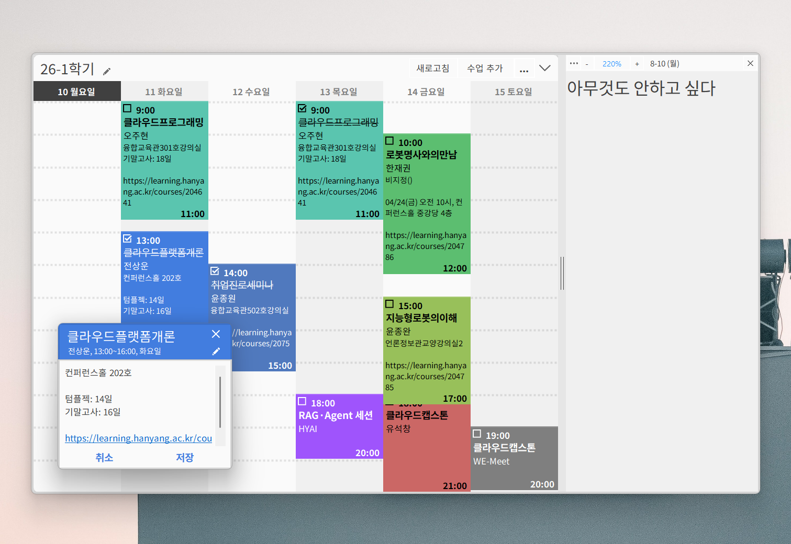

# 유테이블 (uTable)

 
<picture>
  <source
    media="(prefers-color-scheme: dark)"
    srcset="https://raw.githubusercontent.com/pdjdev/uTable/refs/heads/master/utable/Resources/utable_banner_dark.png"
  >
  <source
    media="(prefers-color-scheme: light)"
    srcset="https://raw.githubusercontent.com/pdjdev/uTable/refs/heads/master/utable/Resources/utable_banner.png"
  >
  
</picture>
 

uTable: 대학생에 의한, 대학생을 위한 Windows 데스크톱 시간표 프로그램 

## 다운로드

또는 [GitHub 릴리즈 페이지](https://github.com/pdjdev/uTable/releases)

## 주요 기능
* 간단하게 사용할 수 있는 데스크탑용 시간표 프로그램
* 강의실, 진도 등 강의별 메모 기능 탑재
* 취향에 맞게 화이트, 다크 테마 변경 및 투명도 설정 가능
* 설치 필요 없이 바로 실행, 포터블 용도로 적합한 크기 (0.5MB)
* 에브리타임 계정으로 로그인해 바로 시간표 불러오기 가능
* 고해상도 디스플레이(HDPI) 환경 대응
